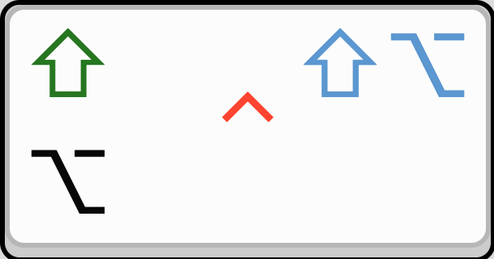
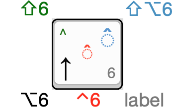

🇺🇸English and 🇷🇺Russian keyboard layouts for macOS
 
with easier access to various †ypogr⎀phical, mathem∀tiℂal, and Grεεk symbols

## Selected features

  - Retains the system macOS layers <kbd>⌥</kbd>[^1] at <kbd>^</kbd><kbd>⌥</kbd> and <kbd>⇧</kbd><kbd>⌥</kbd> at <kbd>⇧</kbd><kbd>^</kbd><kbd>⌥</kbd> (`U.S.` / `Russian - PC`)
  - Extensive diacritics support (◌̀ ◌̈ ◌̃ ◌̣ ◌̧ ◌̨ and combos ȱ ȭ ṩ) with multiple ways to input
  - An extensive separate <kbd>🕱</kbd>`Math` layer (also available as a separate English layout)
  - An extensive separate <kbd>🕱</kbd>`Greek` layer (fully copying the system Greek layout with Greek diacritics)
  - Various-width spaces accessible via <kbd>␠</kbd>
  - Copyright (® ™ ©), Old Cyrillic (ѳ ѣ ѵ), and an extra Typographical layers († ⎀ ⁂ and Mac  ⎋ ⇞⇟)
[^1]: <kbd>⇧</kbd> is <kbd>Shift</kbd>, <kbd>^</kbd> is <kbd>Control</kbd>, <kbd>⌥</kbd> is <kbd>Option</kbd> or <kbd>Alt</kbd>, <kbd>🕱</kbd> is a dead key, <kbd>◌</kbd> is a diacritic dead key

... which all combine into the following layout (all non-<kbd>🕱</kbd> layers in a selectable [html are here](https://eugenesvk.github.io/kbdLayout-Mac/)):

  |    | Modifier key legend	| Example of <kbd>6</kbd> |
  | :- | :-----------------:	| :---------------------: |
  | Symbol's color/position match  the modifier key legend |  | |

##### 🇺🇸 English — TypES: Shift, (Shift)-Option, and Control layers

⌥.png?raw=true "English (Shift)-Option")

##### 🇷🇺 Russian — TypES: Shift, (Shift)-Option, and Control layers

☞ <kbd>⌥</kbd>, <kbd>⇧</kbd><kbd>⌥</kbd>, and <kbd>^</kbd> layers are almost identical to the `English — TypES` layout

⌥.png?raw=true "Russian (Shift)-Option")

## Installation

- Copy `TypES Layout.bundle` to `~/Library/Keyboard Layouts`
- Open `System Preferences` → `Keyboard` → `Input Sources` → `+` to add:
    + `English — TypES`
    + `Russian — TypES`
    + `English — Math` (though it is also embedded in the English/Russian layouts)

## Usage

To allow entering all the extra symbols included in these keyboard layouts, they rely heavily on <kbd>🕱</kbd> or dead keys[^2]. For example <kbd>⌥</kbd><kbd>c</kbd>[^3] is <kbd>🕱</kbd>`Copyright`, pressing it allows entering the following 3 symbols, each with just a single key:

  - `©` with <kbd>c</kbd>
  - `®` with <kbd>r</kbd>
  - `™` with <kbd>t</kbd>

[^2]: <kbd>🕱</kbd> don't generate any symbol by themselves, but instead enter into a new keyboard layer with extra symbols
[^3]: examples use the English layout, however they also work in the Russian layout

Some other notable layers and their respecitve key combos are:

  | <kbd>🕱</kbd> dead key layer |  Key combo | 
  | :-------------------------- | :--------- | 
  | <kbd>🕱</kbd>`Diacritics`   	| <kbd>⌥</kbd><kbd>i</kbd> or <kbd>^</kbd><kbd>;</kbd> or <kbd>^</kbd><kbd>\'</kbd>|
  | <kbd>🕱</kbd>`Typographical`	| <kbd>⌥</kbd><kbd>u</kbd>|
  | <kbd>🕱</kbd>`Math`         	| <kbd>⌥</kbd><kbd>t</kbd> or <kbd>^</kbd><kbd>m</kbd>|
  | <kbd>🕱</kbd>`Greek`        	| <kbd>⌥</kbd><kbd>g</kbd> or <kbd>^</kbd><kbd>g</kbd>|
  | <kbd>🕱</kbd>`OldCyrillic`  	| <kbd>⌥</kbd><kbd>o</kbd>|

Symbols were mapped depending on how a symbol looks compared to a key (<kbd>t</kbd> †) or in a mnemonic way (<kbd>f</kbd> ❧ `fleuron`) although there are too many symbols for all of them to follow such a logic, which leads us to...

### How to find how to insert a symbol

Open the [SymbolsAll-En](./helper/SymbolsAll-En.md) or [SymbolsAll-Ru](./helper/SymbolsAll-Ru.md) files for the English/Russian layouts (or the relevant sections listed below), find a symbol and look at its row/column re. which modifier+key combo produces it (or read the instructions above the table for alternative layouts):

  - `En`[English — TypES Main Layers](./helper/SymbolsAll-En.md#english--types-main-layers) (<kbd>§</kbd>–<kbd>=</kbd>, <kbd>a</kbd>–<kbd>z</kbd>, etc.)
  - `En`[🕱 Spaces](./helper/SymbolsAll-En.md#spaces)
  - `En`[🕱 Diacritics](./helper/SymbolsAll-En.md#diacritics)
  - `En`[🕱 Typographical](./helper/SymbolsAll-En.md#typographical)
  - `En`[🕱 OldCyrillic](./helper/SymbolsAll-En.md#oldcyrillic)
  - `En`[🕱 Copyright](./helper/SymbolsAll-En.md#copyright)
  - `En`[🕱 Math](./helper/SymbolsAll-En.md#math)
  - `En`[🕱 Greek](./helper/SymbolsAll-En.md#greek)
  - `Ru`[Russian — TypES Main Layers](./helper/SymbolsAll-Ru.md#russian--types-main-layers) (<kbd>></kbd>–<kbd>=</kbd>, <kbd>а</kbd>–<kbd>я</kbd>, etc.)
  - `Ru`[🕱 Spaces](./helper/SymbolsAll-Ru.md#spaces)
  - `Ru`[🕱 Diacritics](./helper/SymbolsAll-Ru.md#diacritics)
  - `Ru`[🕱 Typographical](./helper/SymbolsAll-Ru.md#typographical)
  - `Ru`[🕱 OldCyrillic](./helper/SymbolsAll-Ru.md#oldcyrillic)
  - `Ru`[🕱 Copyright](./helper/SymbolsAll-Ru.md#copyright)
  - `Ru`[🕱 Math](./helper/SymbolsAll-Ru.md#math)
  - `Ru`[🕱 Greek](./helper/SymbolsAll-Ru.md#greek)

While the tables listed above have no __symbol names__, the [SymbolsAll_Names](./helper/SymbolsAll_Names.md) file does list all the symbols with their Unicode numbers and names (but without key combos)

### How to insert diacritics

__First__, enter a diacritic <kbd>🕱</kbd> in one of the following 3 ways:

  1. <kbd>^</kbd><kbd>1</kbd> to <kbd>^</kbd><kbd>=</kbd> [^4] 
    for example, <kbd>^</kbd><kbd>6</kbd> for ◌̂ circumflex
  2. mnemonic <kbd>⇧</kbd><kbd>⌥</kbd>  
    for example, <kbd>⇧</kbd><kbd>⌥</kbd><kbd>:</kbd> for ◌̈ diaeresis
  3. single key press from 1) or 2) within meta-<kbd>🕱</kbd>`Diacritics` <kbd>^</kbd><kbd>;</kbd> or <kbd>^</kbd><kbd>\'</kbd>  
    for example, <kbd>6</kbd> for ◌̂ circumflex or <kbd>;</kbd> for ◌̈ diaeresis
[^4]: some <kbd>^</kbd>+<kbd>x</kbd> keybinds maybe unavailable due to app/system shortcuts

__Then__, type a single desired letter that supports such a diacritic.
For example: press <kbd>^</kbd><kbd>6</kbd> to enter ◌̂ <kbd>🕱</kbd>`circumflex`, then press <kbd>u</kbd> to insert û

Combining diacritics can be inserted once inside a given diacritic <kbd>🕱</kbd> by pressing either the:

  1. invoking number: <kbd>u</kbd>, <kbd>^</kbd><kbd>6</kbd>, <kbd>6</kbd> insert û
  2. same key combo: <kbd>u</kbd>, <kbd>⇧</kbd><kbd>⌥</kbd><kbd>:</kbd>, <kbd>⇧</kbd><kbd>⌥</kbd><kbd>:</kbd> to insert ü
  3. same key (if this key doesn't support this specific diacritic): <kbd>u</kbd>, <kbd>⇧</kbd><kbd>⌥</kbd><kbd>:</kbd>, <kbd>;</kbd> to insert ü (since __;__ doesn't support __;̈__)

☞ A letter after a combining diacritic produces a single combined letter, while a combining diacritic after a letter produces two combined symbols (and can be applied to any symbol even if such symbol doesn't support a diacritic):

  - <kbd>u</kbd>, <kbd>^</kbd><kbd>6</kbd> = û `U+00FB` `Latin Small Letter U with Circumflex`  
  - <kbd>^</kbd><kbd>6</kbd>, <kbd>u</kbd> = û `U+0075` `Latin Small Letter U` + `U+0302` `Combining Circumflex Accent`

### Additional tips

#### Insert English <kbd>⇧</kbd><kbd>1</kbd>–<kbd>0</kbd> symbols in the Russian layout

Russian layout has somehwat different <kbd>⇧</kbd><kbd>1</kbd>–<kbd>0</kbd> symbols —

  | ↓Layout / Key→ 	| <kbd>2</kbd>	| <kbd>3</kbd>	| <kbd>4</kbd>	| <kbd>6</kbd>	| <kbd>7</kbd>	|
  | :-----         	| :----------:	| :----------:	| :----------:	| :----------:	| :----------:	|
  | English — TypES	|  @          	| #           	| $           	| ^           	| &           	|
  | Russian — TypES	| \"          	| №           	| ;           	| :           	| ?           	|

— which in the system layout is resolved by mapping <kbd>⌥</kbd><kbd>1</kbd>–<kbd>0</kbd> to <kbd>⇧</kbd><kbd>1</kbd>–<kbd>0</kbd> symbols from the English layout. However, these `TypES` layouts have mostly identical <kbd>⌥</kbd> layers, so there are two alternatives to enter the English symbols with <kbd>1</kbd>–<kbd>0</kbd>:

  1. Use <kbd>^</kbd><kbd>⌥</kbd> that copies the <kbd>⌥</kbd> layer of the `Russian - PC` layout  
  2. Use [Karabiner-Elements](https://karabiner-elements.pqrs.org) to remap <kbd>right⇧</kbd> to insert English characters in the Russian layout (unfortunately, keyboard layouts can't differentiate between left and right keys):
      + copy this [config file](./helper/karabiner-elements/ru-RShift=en-LShift.json) to `~/.config/karabiner/assets/complex_modifications`
      + in `Karabiner-Elements`→`Complex modifications`→`Add rule` add the rule named `"  Ru RShift+1–4,6–7 to En: r⇧1–4,6–7 ⟶ ⌃⌥1–4,6–7 (in 'Russian — TypES' mapped to en⇧)"` under the group `ruR⇧≈enL⇧`

#### Delete the default keyboard layout

For macOS `10.9` and later[^5]:

  - Change the current input source to your custom keyboard layout added above
  - Backup then open `~/Library/Preferences/com.apple.HIToolbox.plist`
  - Remove the input source you want to disable from the `AppleEnabledInputSources` dictionary
  - Remove the `AppleDefaultAsciiInputSource` key if it exists
  - Restart
[^5]: from this [stackexchange comment](https://apple.stackexchange.com/questions/44921/how-to-remove-or-disable-a-default-keyboard-layout#60521)

☞ Backspace <kbd>⌫</kbd> within dead keys inside <kbd>🕱</kbd>`Math` (e.g., <kbd>🕱</kbd>`math-`) returns to <kbd>🕱</kbd>`Math` instead of returning to the main layer, allowing for some error correction, for example:

  - <kbd>⌥</kbd><kbd>t</kbd> Enter <kbd>🕱</kbd>`Math`
  - <kbd>-</kbd>     Mistakenly enter <kbd>🕱</kbd>`math-`
  - <kbd>⌫</kbd>     Go back to <kbd>🕱</kbd>`Math`
  - <kbd>=</kbd>     Correctly enter <kbd>🕱</kbd>`math=`
  - <kbd>)</kbd>     Insert ⟹

## Credits
  - [Ilya Birman Typography Layout](https://ilyabirman.ru/projects/typography-layout/faq/), v3.7
  - [English Math](https://tex.stackexchange.com/questions/110042/entering-unicode-math-symbols-into-latex-direct-from-keyboard-on-a-mac/110043#110043) layout
  - [Ukelele](https://github.com/sillsdev/Ukelele) keyboard layout editing app
  - Online [Keyboard Layout Editor](http://www.keyboard-layout-editor.com/)
